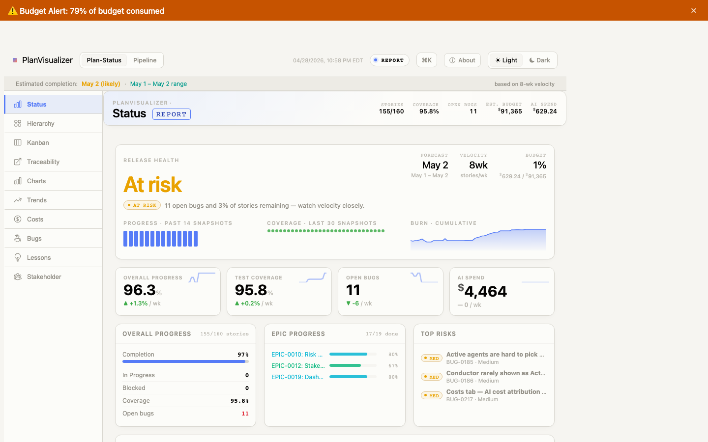
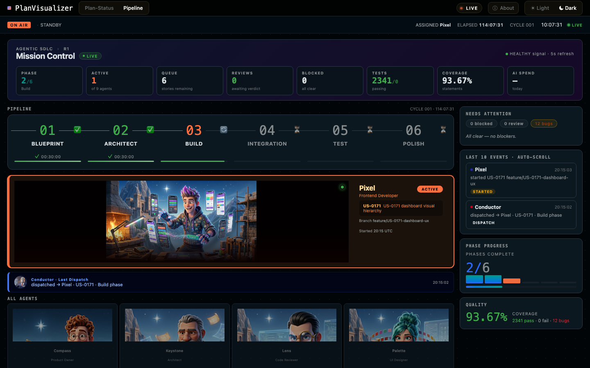

# PlanVisualizer

A self-contained project dashboard for Claude Code projects. Parses your `RELEASE_PLAN.md`, `TEST_CASES.md`, `BUGS.md`, `AI_COST_LOG.md`, `LESSONS.md`, coverage JSON, and `progress.md` into a static `plan-status.html` with ten tabs:

**Hierarchy · Kanban · Traceability · Status · Charts · Trends · Costs · Bugs · Lessons · Stakeholder · Settings**

Press `⌘K` / `Ctrl+K` to open the global search modal and jump to any story, bug, or lesson by ID or keyword.

No runtime dependencies — Node.js and git only.


| Plan Status Dashboard                                      | Agentic Dashboard                                            |
| ---------------------------------------------------------- | ------------------------------------------------------------ |
|  |  |

---

## What's New in v2.1.0

- **Trends Date-Range Picker** — `From` / `To` date inputs sit beside the existing All / 90d / 30d / 7d preset buttons. Selecting a date range filters all trend charts to snapshots within that window. Both modes persist to `localStorage` and restore on page load. The weekly velocity chart is excluded (ISO week axis).
- **Hierarchy Risk UI** — Epics are pre-sorted by aggregate risk score descending. Story rows carry `data-risk-score` and `data-risk-level` attributes. A **Sort by Risk ↓** button sorts story rows within each epic by score. A **Risk Level** select (All / High+ / Critical) hides/shows epic blocks. Epic headers show an aggregate risk badge for non-Done epics. The Avg Risk Score trend chart gains a dashed **High threshold** reference line at y = 2.0.
- **Agentic Dashboard Lap Strip** — Completed cycles render as 32 px segmented phase bars proportional to per-phase durations. Hover shows `Cycle #N · elapsed · Xd ago`. Click opens a per-phase timing dialog. Failed cycles highlight in risk colour.
- **Cycle Completion Animation** — On `cycle-complete`: phase blocks flash green (300 ms), a green sweep overlay crosses the conductor header (600 ms), and the dispatch counter flips (150 ms).
- **Telemetry Row** — Conductor section now shows AVG CYCLE TIME · CYCLES TODAY · INCIDENTS · SUCCESS RATE derived from the `cycles[]` array.
- **Settings Tab** — A new ⚙ Settings sidebar tab lets you configure and enable/disable GitHub Issues Sync (EPIC-0025, coming in v2.2) without editing the config file manually. Shows current config values, last sync summary, token status, and a **Copy config JSON** button.

---

## What's New in v2.0.0

- **Stakeholder Tab** — A business-facing view with an editorial "On track / At risk / Off track" verdict, go/no-go decision widgets, epic progress by plain-language status, and forecast date. Shareable with non-technical stakeholders.
- **OKLCH Design System** — Both dashboards now use a unified OKLCH colour palette with zero hex literals. Charts, badges, and sparklines share the same semantic tokens (ok/warn/risk/info/accent).
- **Agentic Dashboard Visual Hierarchy** — Active agent card now shows the full landscape agent portrait (200px banner), a pulsing status dot, and story context. Idle agents appear at 65% opacity in a 4-column grid. Conductor shows its last dispatch persistently.
- **Status Tab Hero** — Large verdict headline (28px), "Release Health" eyebrow, forecast banner promoted above sparklines, placeholder bars when trend data is sparse.
- **No CDN Dependencies** — Tailwind CDN, Chart.js CDN, and Google Fonts removed. All CSS uses `var(--*)` custom properties and system font stacks.
- **Playwright E2E Tests** — `tests/e2e/dashboard-hierarchy.spec.js` validates visual hierarchy invariants on every CI run (chrome height, active card prominence, event log position).
- **Risk Analytics** — Per-story and per-epic risk scores (priority × severity × status) with level badges (Low / Medium / High / Critical).
- **Cost Attribution Fix** — Branch costs now split evenly across all artefacts sharing a fix branch, eliminating duplicated totals.
- **AI Cost Log Recovery** — `git stash show -p` extraction technique documented for recovering trapped cost rows (see L-0051).

---

## Prerequisites

- Node.js 18+
- git
- A project with `package.json` (files can be empty to start — see `plan_visualizer.md` for required formats)

---

## Quickstart

### Install via script

```bash
# From your project root:
git clone https://github.com/ksyed0/PlanVisualizer.git /tmp/PlanVisualizer
bash /tmp/PlanVisualizer/scripts/install.sh
rm -rf /tmp/PlanVisualizer
```

The script copies `tools/`, `tests/`, `jest.config.js`, merges npm scripts into your `package.json`, creates `plan-visualizer.config.json` from the example template, sets up the Claude Code stop hook, and prompts whether to estimate historical data for trend analysis.

### Install via Claude Code

Paste this prompt directly into Claude Code in your target repo:

```
Install the PlanVisualizer tool into this project from the ksyed0/PlanVisualizer
GitHub repo. Clone it to a temp directory, run scripts/install.sh targeting this
project root, create plan-visualizer.config.json with the correct project name and
file paths for this project, copy the .github/workflows/plan-visualizer.yml workflow,
run npm run plan:test from the repo root to confirm all suites pass, then commit all
added files to the current branch. The install script will copy plan_visualizer.md
into this project root, automatically update AGENTS.md with a reference to it,
merge the Claude Code Stop hook for capture-cost.js into .claude/settings.json,
and prompt for historical data backfill (if project data exists).
```

---

## Configuration

After installation, edit `plan-visualizer.config.json` in your project root:

| Key                    | Default                                 | Description                                                             |
| ---------------------- | --------------------------------------- | ----------------------------------------------------------------------- |
| `project.name`         | `"My Project"`                          | Display name shown in the dashboard title                               |
| `project.tagline`      | `"A short description."`                | Subtitle shown in the dashboard header                                  |
| `project.githubUrl`    | `""`                                    | GitHub repository URL shown in the About dialog                         |
| `docs.releasePlan`     | `"docs/RELEASE_PLAN.md"`                | Path to release plan (EPICs, stories, tasks)                            |
| `docs.testCases`       | `"docs/TEST_CASES.md"`                  | Path to test cases                                                      |
| `docs.bugs`            | `"docs/BUGS.md"`                        | Path to bug log                                                         |
| `docs.costLog`         | `"docs/AI_COST_LOG.md"`                 | Path to AI cost ledger                                                  |
| `docs.lessons`         | `"docs/LESSONS.md"`                     | Path to lessons log (surfaced in Lessons tab)                           |
| `docs.outputDir`       | `"docs"`                                | Directory where `plan-status.html` is written                           |
| `coverage.summaryPath` | `"docs/coverage/coverage-summary.json"` | Path to Jest `coverage-summary.json`                                    |
| `progress.path`        | `"progress.md"`                         | Path to session progress log                                            |
| `costs.hourlyRate`     | `100`                                   | Hourly rate (USD) for projected cost estimates                          |
| `costs.tshirtHours`    | `{XS:2, S:4, M:8, L:16, XL:32}`         | Hours per t-shirt size estimate                                         |
| `github.enabled`       | `false`                                 | Enable GitHub Issues sync (requires `GITHUB_TOKEN` env var)             |
| `github.repo`          | `"owner/repo"`                          | GitHub repository to sync with (e.g. `"ksyed0/PlanVisualizer"`)         |
| `github.syncBugs`      | `true`                                  | Sync BUGS.md entries ↔ GitHub Issues                                    |
| `github.syncStories`   | `false`                                 | Sync RELEASE_PLAN.md stories ↔ GitHub Issues (opt-in)                   |
| `github.labelMap`      | `{Critical,High,Medium,Low}`            | Maps PlanVisualizer severity → GitHub label name                        |
| `github.defaultLabels` | `["planvisualizer"]`                    | Labels added to every created Issue; also used to filter inbound Issues |

> **GitHub sync token:** Set `GITHUB_TOKEN` as an environment variable — never put it in the config file. The Settings tab in `plan-status.html` shows `✓ Set` / `✗ Not set` at generation time and provides a **Copy config JSON** button to export your current settings.

All paths are relative to the project root. If no config file is present, built-in defaults are used.

> **Case sensitivity:** File and directory paths are case-sensitive on Linux (including GitHub Actions). Make sure the case in your config exactly matches the actual file and directory names on disk — e.g. `docs/BUGS.md` and `docs/bugs.md` are different paths. Mismatches that work locally on macOS will fail in CI.

---

## Usage

```bash
# Generate the dashboard
node tools/generate-plan.js
# → writes docs/plan-status.html and docs/plan-status.json

# Run tool unit tests
npm run plan:test

# Run with coverage
npm run plan:test:coverage
```

The Claude Code Stop hook (`tools/capture-cost.js`) appends session token usage and cost to `AI_COST_LOG.md` automatically at the end of every Claude Code session. It reads token counts from the JSONL transcript at `~/.claude/projects/<project>/<session_id>.jsonl` (using the `transcript_path` provided in the Stop hook stdin, with a glob fallback) and computes cost from per-type rates. The "Input Tokens" column includes both direct input and cache-write tokens.

### Branch hygiene (for agentic pipelines)

If you run multi-story epics through the DM_AGENT pipeline, you'll accumulate `.claude/worktrees/agent-*` directories + orphan feature branches as sub-agents spawn. The cleanup script sweeps all of it:

```bash
npm run plan:cleanup:dry    # preview what would be deleted
npm run plan:cleanup        # execute the sweep
```

Six-step pass: remove agent worktrees → prune origin → delete local branches with gone upstream → force-delete squash-merged local branches → delete orphan `chore/version-bump-*` remote branches (open-PR gated) → delete merged `feature/bugfix/chore` remote branches (open-PR gated). Preserves `develop`, `main`, `origin/gh-pages` always. Idempotent.

### Continuous Deployment

The included `.github/workflows/plan-visualizer.yml` workflow triggers on pushes to `main` or `develop` when any of the tracked docs files change. It runs tests with coverage, generates `plan-status.html`, and deploys to GitHub Pages automatically.

> **Note:** To allow deploys from `develop`, go to **Settings → Environments → github-pages → Deployment branches** and add `develop` to the allowed list.

---

## Manual Setup

If you prefer not to use the install script:

1. Copy `plan_visualizer.md` from the PlanVisualizer repo into your project root. Append the following to your `AGENTS.md` (or create one if absent):
   ```
   ## PlanVisualizer Format Requirements
   Read plan_visualizer.md for the exact document formats required for RELEASE_PLAN.md,
   TEST_CASES.md, BUGS.md, AI_COST_LOG.md, and progress.md.
   ```
2. Copy `tools/`, `tests/`, `jest.config.js`, `eslint.config.js` into your project root
3. Copy `.github/workflows/plan-visualizer.yml` to `.github/workflows/`
4. Add to your `package.json` scripts:
   ```json
   "plan:test": "jest --watchAll=false",
   "plan:test:coverage": "jest --watchAll=false --coverage",
   "plan:generate": "node tools/generate-plan.js"
   ```
5. Copy `plan-visualizer.config.example.json` to `plan-visualizer.config.json` and edit it
6. Ensure `.claude/settings.json` contains the Stop hook (the install script does this automatically):
   ```json
   {
     "hooks": {
       "Stop": [{ "hooks": [{ "type": "command", "command": "node tools/capture-cost.js" }] }]
     }
   }
   ```
7. Add `docs/coverage/` to your `.gitignore`

---

## Updating

Re-run the install script to update to the latest version:

```bash
git clone https://github.com/ksyed0/PlanVisualizer.git /tmp/PlanVisualizer
bash /tmp/PlanVisualizer/scripts/install.sh
rm -rf /tmp/PlanVisualizer
```

The script is idempotent — it is safe to re-run at any time. If you have existing project data, it will prompt: "Would you like to estimate historical data? (y/n)" — answering yes runs a 30-day backfill to populate trend charts immediately.

**What gets overwritten on update:** `tools/`, `tests/` (including `tests/e2e/`), `scripts/cleanup-branches.sh`, `jest.config.js`, `playwright.config.js`, `plan_visualizer.md`, `.github/workflows/plan-visualizer.yml`, `eslint.config.js` — these are tool files managed by PlanVisualizer.

**Config schema migration runs automatically** on every install/upgrade — `tools/migrate-config.js` adds any required fields introduced in newer versions (e.g. `docs.lessons`, `agents.<name>.avatar`) to your existing `plan-visualizer.config.json` and `agents.config.json` without touching values you've already set. Preview what would change with `npm run plan:migrate-config:dry`; apply manually with `npm run plan:migrate-config`. Safe to re-run.

**v2.1.0 migrations (applied automatically):**

- `plan-visualizer.config.json` gains a `github` block (`enabled: false` by default) — opt-in GitHub Issues sync config.
- `costs.tshirtHours.XS` defaults to `2` if absent.

**v2.0.0 migrations (applied automatically):**

- `agents.config.json` gains `project` (name, description, repoUrl, startDate) and `phases` sections. Agent colours migrate from hex to oklch values automatically (e.g. `"color": "oklch(52% 0.22 25)"`).

Run `npm run plan:migrate-config` once after upgrading — it is idempotent and safe to re-run.

**Historical data:** When updating, the install script will ask "Would you like to estimate historical data? (y/n)" — answering yes runs a 30-day backfill to populate trend charts immediately with simulated historical data. Answering no lets history build naturally from real generations.

**What is never overwritten:** `plan-visualizer.config.json` (your project config), `AGENTS.md` content (the script only appends; it will skip if the reference already exists).

### Update via Claude Code

Paste this prompt directly into Claude Code in your target repo:

```
Update the PlanVisualizer tool in this project from the ksyed0/PlanVisualizer
GitHub repo. Clone it to a temp directory, run scripts/install.sh targeting this
project root, run npm run plan:test from the repo root to confirm all suites pass, then
commit all changed files to the current branch. The install script will prompt for
historical data backfill if existing project data is detected.
```

---

## Agentic SDLC Dashboard

A live dashboard that visualises pipeline agent activity at `docs/dashboard.html`.

**Adopting in another project:** see [`docs/dashboard-extraction.md`](docs/dashboard-extraction.md).

---

## Credits

The `AGENTS.md` operating framework included with this tool is based on the **BLAST framework** originally developed by **Jack Roberts** ([Jack@JackRoberts.ai](mailto:Jack@JackRoberts.ai)).

---

## License

MIT
