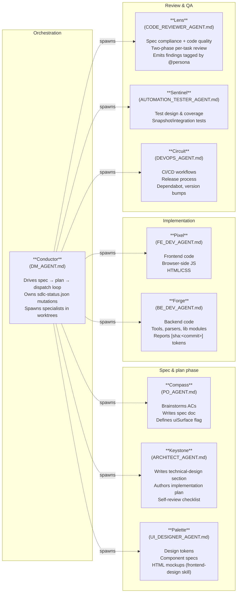
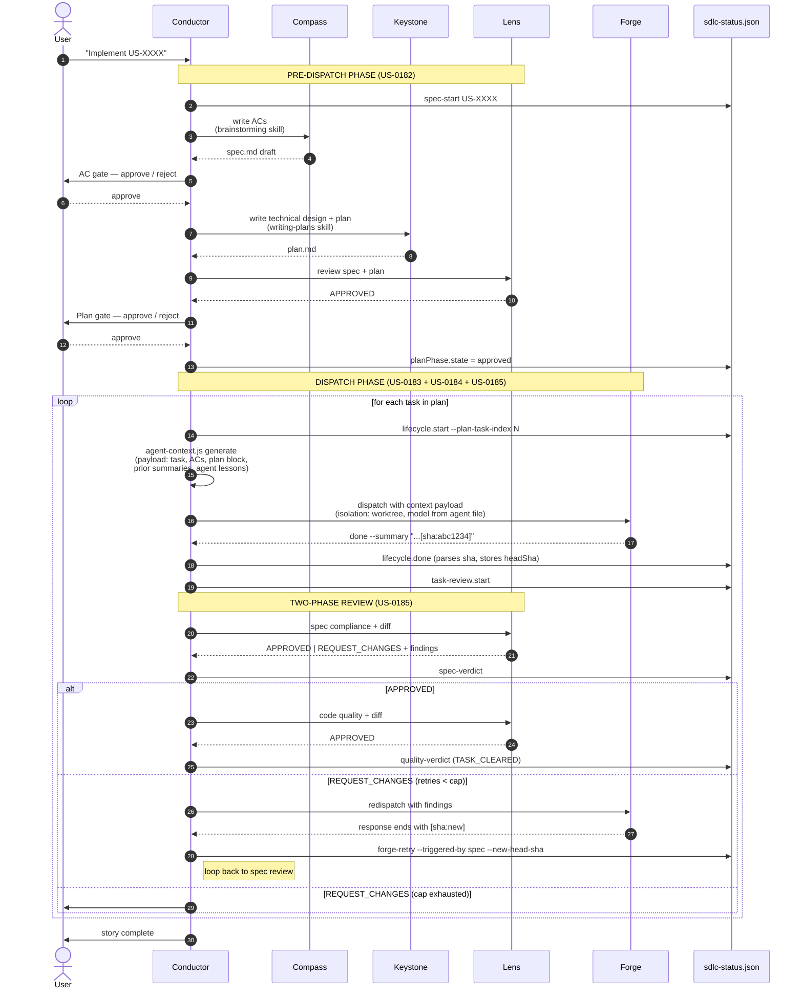
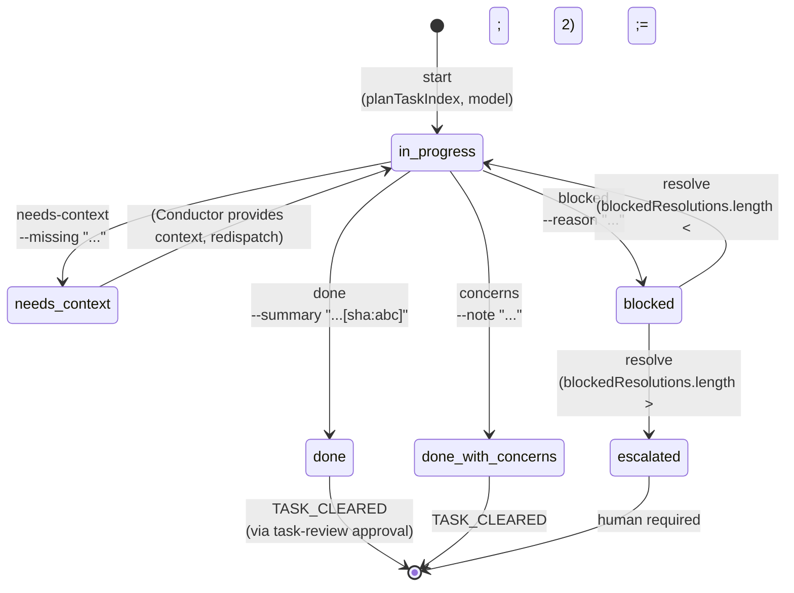
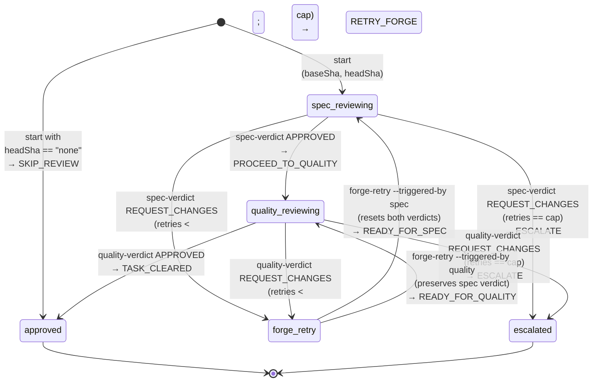
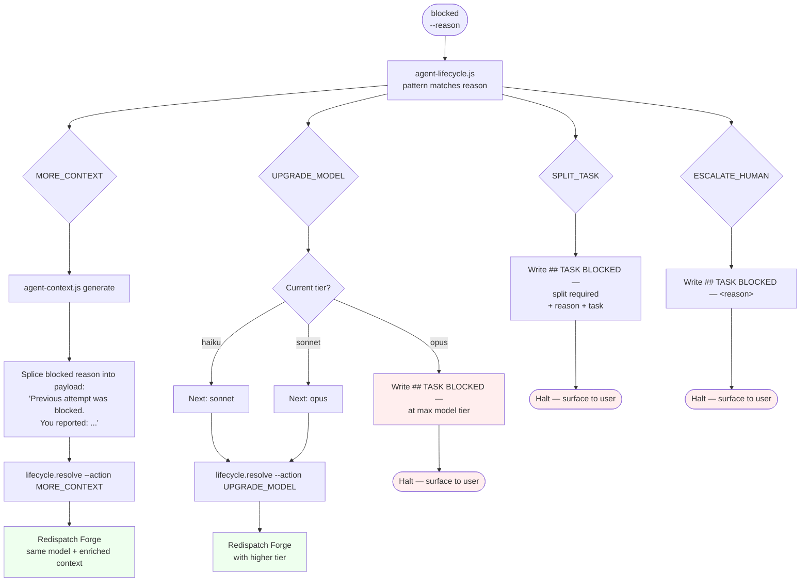
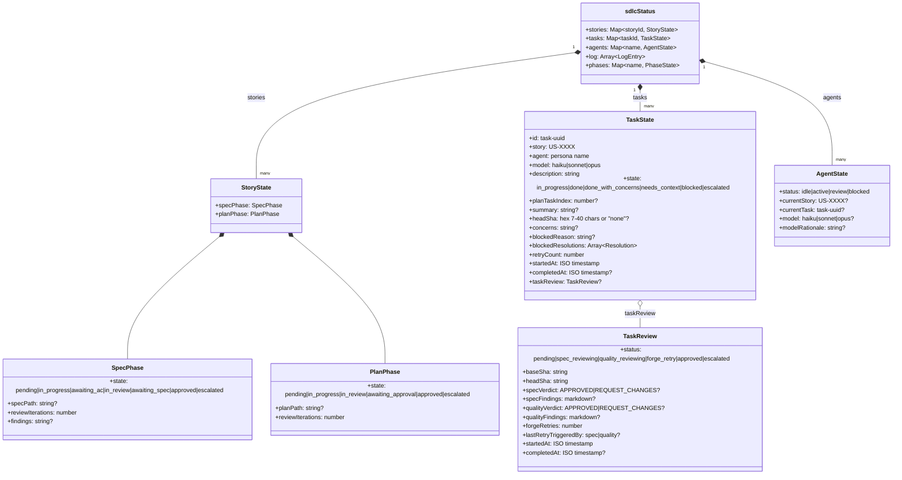

# Agentic Pipeline Architecture

**Version:** 1.0
**Status:** Active
**Last Updated:** 2026-05-18
**Covers:** EPIC-0028 (Agentic Orchestration Engine) + EPIC-0029 (Agentic Pipeline UX)

This document is the authoritative reference for how PlanVisualizer's agentic pipeline works end-to-end — from a user requesting a story to the Conductor dispatching specialists, gating their work through reviews, and displaying live state on the Agentic Dashboard.

For the static dashboard architecture (parsers, renderers, plan-status.html), see `ARCHITECTURE.md`. For product vision and user profile, see `DESIGN.md`.

---

## 1. System Layers

```mermaid
flowchart TB
  subgraph Source["Markdown source of truth"]
    RP[RELEASE_PLAN.md<br/>epics · stories · ACs]
    LM[LESSONS.md<br/>@agent: tagged]
    SP[Spec docs<br/>docs/superpowers/specs/]
    PL[Plan docs<br/>docs/superpowers/plans/]
    PG[progress.md<br/>session log]
    SDLC[sdlc-status.json<br/>runtime state]
  end

  subgraph Engine["Agentic Orchestration Engine (EPIC-0028)"]
    SPP[agent-spec-plan.js<br/>US-0182<br/>spec/plan phase state machine]
    LF[agent-lifecycle.js<br/>US-0183<br/>per-task state machine]
    CX[agent-context.js<br/>US-0184<br/>context curator]
    TR[agent-task-review.js<br/>US-0185<br/>review-gate state machine]
  end

  subgraph Personas["Specialist personas (dispatched as sub-agents)"]
    COND[Conductor<br/>orchestrator]
    COMP[Compass<br/>PO]
    KEY[Keystone<br/>architect]
    PAL[Palette<br/>UI design]
    PIX[Pixel<br/>frontend]
    FRG[Forge<br/>backend]
    LNS[Lens<br/>reviewer]
    SNT[Sentinel<br/>QA]
    CIR[Circuit<br/>DevOps]
  end

  subgraph Display["Static + live UI"]
    SH[plan-status.html<br/>static report]
    DH[dashboard.html<br/>Agentic Dashboard<br/>live, 5s refresh]
    DTR[dashboard-task-review.js<br/>US-0186<br/>review-gate visualization]
  end

  COND -->|reads & writes| SDLC
  COND -->|drives| SPP
  COND -->|drives| LF
  COND -->|spawns| Personas
  COND -->|calls| CX
  COND -->|drives| TR

  SPP --> SDLC
  LF --> SDLC
  TR --> SDLC

  CX -->|reads| SP
  CX -->|reads| PL
  CX -->|reads| LM
  CX -->|reads| SDLC

  SDLC --> DH
  DTR -.injected via fn.toString.-> DH
  RP --> SH
  PG --> SH
```

**Key invariant:** every mutation to runtime state goes through `sdlc-status.json` via one of the four CLI tools. The dashboard reads, never writes. Personas write via the Conductor's CLI invocations, never directly.

---

## 2. Personas

The orchestration engine treats each role as a **persona** — a stable handle used in dispatch, lifecycle records, and lesson tagging. Persona names are independent of the markdown agent files (`docs/agents/*.md`) so the engine doesn't depend on filenames.



Each persona's `_AGENT.md` file declares its `## Model Selection` table (haiku/sonnet/opus rationale per task type — US-0180). The Conductor reads this before every dispatch.

---

## 3. End-to-End Story Flow

The high-level lifecycle from "implement US-XXXX" to "task cleared, next task":



---

## 4. Per-Task Lifecycle State Machine (US-0183)

The lifecycle of a single task within a story dispatch. Driven entirely by `tools/agent-lifecycle.js`.



**Smart BLOCKED routing** (`agent-lifecycle.js blocked` emits a routing token):

| Reason pattern                                        | Routing          | Conductor action                                                       |
| ----------------------------------------------------- | ---------------- | ---------------------------------------------------------------------- |
| `missing` / `not found` / `undefined` / `cannot find` | `MORE_CONTEXT`   | Regenerate context + splice blocked reason → redispatch (same model)   |
| `ambiguous` / `unclear` / `which` / `conflicting`     | `MORE_CONTEXT`   | Same as above                                                          |
| `complex` / `too many` / `too big` / `scope`          | `SPLIT_TASK`     | Halt + write `## TASK BLOCKED — split required` to progress.md → human |
| `permission` / `access` / `auth` / `credentials`      | `ESCALATE_HUMAN` | Halt + write `## TASK BLOCKED — <reason>` → human                      |
| anything else                                         | `UPGRADE_MODEL`  | Next tier haiku → sonnet → opus; at opus → escalate                    |

**Escalation cap:** after 2 `resolve` calls without a successful `done`, the next `blocked` forces `escalated`. Configurable via `orchestration.iterationCap.{spec,plan}` (not retroactive — the lifecycle cap is hardcoded at 2).

---

## 5. Per-Task Review Gate State Machine (US-0185)

Driven by `tools/agent-task-review.js`. Runs after a task transitions to `done` or `done_with_concerns`. State lives on `task.taskReview`.



**Stdout token contract:** every command emits exactly one _next-action_ token on stdout. Conductor scripts read with `$()` and `case` on the token. Exit 0 = state recorded; exit 1 = bad args / invalid state transition. This makes Conductor scripts robust to `set -e`.

**Cap:** `orchestration.iterationCap.taskReview` (default 2). Independent of the US-0183 escalation cap — a single task can exhaust both caps without overlap.

---

## 6. Automated BLOCKED Routing (US-0185)



`MORE_CONTEXT` and `UPGRADE_MODEL` resolve without human intervention. `SPLIT_TASK` and `ESCALATE_HUMAN` always halt and surface — the task may be too large or require credentials only a human can supply. Auto-split via Keystone is deliberately deferred (plan-doc mutation risk).

---

## 7. Context Curation Flow (US-0184)

Before every Forge dispatch (including retries), the Conductor calls `agent-context.js generate` to produce a structured markdown payload.

```mermaid
flowchart LR
  subgraph Inputs
    Task[Task record<br/>from sdlc-status.json]
    Spec[Spec doc<br/>via specPath]
    Plan[Plan doc<br/>via planPath + planTaskIndex]
    Lessons[LESSONS.md<br/>filtered by @agent tag]
    Prior[Prior completed tasks<br/>for same story<br/>with summaries]
  end

  subgraph Tool[agent-context.js generate]
    Reader[Reads:<br/>sdlc-status.json<br/>+ spec/plan/LESSONS]
    Assembler[Pure assembler<br/>tools/lib/agent-context-assembler.js]
  end

  Inputs --> Reader
  Reader --> Assembler

  Assembler --> Out[Structured markdown payload<br/>printed to stdout]
  Out --> Conductor[Conductor captures via $(...)<br/>injects at top of dispatch prompt]
```

**Payload sections** (each suppressed if empty — task description is the irreducible minimum):

1. **Header** — `## Context for {Agent} — {Story} (Task N/M)`
2. **Your task** — task description verbatim
3. **Story acceptance criteria** — parsed from spec doc
4. **Plan excerpt** — task block from plan doc at `planTaskIndex`
5. **Prior work on this story** — bullets per completed task with `summary` and `concerns`
6. **Relevant lessons for {Agent}** — LESSONS.md entries tagged `@agent: {Agent}` or `@agent: all`

The assembler is a pure function — zero filesystem access. The CLI owns all I/O.

---

## 8. Dashboard Visualization (US-0186)

The Agentic Dashboard reads `sdlc-status.json` every 5 seconds and patches the DOM. US-0186 added review-gate visualization on each task row.

```mermaid
flowchart TD
  subgraph Browser
    Load([Page load]) --> Init[initTaskDensity<br/>reads localStorage 'pv-task-density'<br/>fallback 'L']
    Init --> Active[setTaskDensity 'S'|'M'|'L'<br/>updates window.pvTaskDensity<br/>toggles .active class]

    Tick([5s refresh tick]) --> Fetch[refreshState fetches<br/>sdlc-status.json]
    Fetch --> Cache[window._pvLastStatus = status]
    Cache --> Patch[patchTaskList&lpar;status&rpar;]

    Click([User clicks S/M/L]) --> Save[setTaskDensity<br/>writes localStorage<br/>toggles .active]
    Save --> Rerender[patchTaskList&lpar;_pvLastStatus&rpar;<br/>immediate re-render]
    Save --> Active

    Patch --> Loop[For each active agent card<br/>+ each task in story]
    Rerender --> Loop

    Loop --> Derive[deriveDisplayState&lpar;task.taskReview&rpar;]
    Derive --> Mode{window.pvTaskDensity}
    Mode -->|S| RS[renderReviewIconS]
    Mode -->|M| RM[renderReviewChipsM]
    Mode -->|L| RL[renderReviewLineL]
    RS --> DOM[innerHTML of task row]
    RM --> DOM
    RL --> DOM
  end

  subgraph Source["Function source"]
    Mod[tools/lib/dashboard-task-review.js<br/>require'd server-side for tests]
    Inject[generate-dashboard.js<br/>injects fn.toString'd source<br/>into HTML script block]
    Mod -.same source.-> Inject
    Inject -.embedded.-> Derive
    Inject -.embedded.-> RS
    Inject -.embedded.-> RM
    Inject -.embedded.-> RL
  end
```

**`fn.toString()` injection** is the architectural trick: the same JS source runs in Jest (CommonJS require) and in the browser (embedded literal). No bundler, no IIFE wrapping, no code duplication. Documented as L-0068.

**Three render modes** (chosen by topbar S/M/L pill, persisted to localStorage):

- **S** — compact single icon (`✓` / `⟳` / `✗`) appended to row
- **M** — small chips `[SPEC ✓] [QUAL ⟳]` right-aligned
- **L** (default) — second indented line `Spec ✓ · Quality ⟳ · retry 1/2`

---

## 9. Data Schema — `sdlc-status.json`

The runtime state file. Mutated only via the four orchestration tools.



**Field provenance:**

- `tasks.{uuid}.taskReview` — added in **US-0185**
- `tasks.{uuid}.{summary,headSha,planTaskIndex}` — added in **US-0184** and **US-0185**
- `tasks.{uuid}.blockedResolutions` + `retryCount` — added in **US-0183**
- `stories.{id}.{specPhase,planPhase}` — added in **US-0182**
- `agents.{name}.{model,modelRationale}` — added in **US-0180**

---

## 10. CLI Surface Summary

The four orchestration tools, with their command verbs:

| Tool                         | Commands                                                                                                                                                                                                                                               | Purpose                                                                                                                                                     |
| ---------------------------- | ------------------------------------------------------------------------------------------------------------------------------------------------------------------------------------------------------------------------------------------------------ | ----------------------------------------------------------------------------------------------------------------------------------------------------------- |
| `tools/agent-spec-plan.js`   | `spec-start`, `spec-await-ac`, `spec-review-result`, `spec-await-final`, `plan-start`, `plan-update`, `plan-review-result`, `plan-await-approval`, `approve`, `reject`, `spec-gap`, `plan-spec-gap`, `apply-pending`, `show-pending`, `list`, `status` | Spec & plan phase orchestration with user approval gates (US-0182)                                                                                          |
| `tools/agent-lifecycle.js`   | `start`, `done`, `concerns`, `needs-context`, `blocked`, `resolve`, `list`, `status`                                                                                                                                                                   | Per-task lifecycle state machine + smart BLOCKED routing suggestions (US-0183); `start --plan-task-index N`, `done --summary "...[sha:abc]"` (US-0184/0185) |
| `tools/agent-context.js`     | `generate`                                                                                                                                                                                                                                             | Assemble structured context payload for a task (US-0184)                                                                                                    |
| `tools/agent-task-review.js` | `start`, `spec-verdict`, `quality-verdict`, `forge-retry`, `status`                                                                                                                                                                                    | Per-task two-phase review gate state machine (US-0185)                                                                                                      |

All tools share the same architecture: **thin CLI wrapper + pure state module**. The state module (`tools/lib/{tool}-state.js`) is fully unit-testable with in-memory fixtures; the CLI wrapper owns all I/O.

---

## 11. Story → Capability Map

| Story       | Capability added                                       | Tools / files                                                                                                                              |
| ----------- | ------------------------------------------------------ | ------------------------------------------------------------------------------------------------------------------------------------------ |
| **US-0182** | Pre-dispatch spec/plan orchestration with user gates   | `agent-spec-plan.js` + state module; DM_AGENT.md `§Pre-Dispatch Spec & Plan Orchestration`                                                 |
| **US-0183** | Per-task lifecycle tracking with smart BLOCKED routing | `agent-lifecycle.js` + state module; `tasks.{uuid}` schema; DM_AGENT.md `§Per-Task Dispatch Ritual`                                        |
| **US-0184** | Context Curator generates structured dispatch payloads | `agent-context.js` + assembler; LESSONS.md `@agent:` tagging convention; `--plan-task-index` + `--summary` schema patches                  |
| **US-0185** | Two-phase Lens review gate + automated BLOCKED routing | `agent-task-review.js` + state module; `taskReview` schema; `[sha:<commit>]` convention; BE_DEV_AGENT/FE_DEV_AGENT `§Commit SHA Reporting` |
| **US-0186** | Dashboard review-gate visualization (S/M/L modes)      | `tools/lib/dashboard-task-review.js`; `generate-dashboard.js` extensions; topbar density pill                                              |

---

## 12. Outstanding gaps (next stories)

- **EPIC-0029 backlog beyond US-0186:**
  - Surface BLOCKED routing decisions on the dashboard (which suggestion fired, retry count)
  - Lifecycle timeline view per story (visual: task 1 → 2 → 3 with elapsed times)
  - Model-tier escalation traces (haiku → sonnet → opus chain visualization)
- **Pipeline self-test:** dogfood the full loop on the next story end-to-end and watch the dashboard
- **SPLIT_TASK auto-decomposition via Keystone** — deferred from US-0185 (plan-doc mutation risk too high without iteration on protocol first)

---

## 13. Cross-references

- **Spec docs** (the source of truth for each story's contract):
  - `docs/superpowers/specs/2026-05-11-us-0181-pre-dispatch-spec-plan-orchestration-design.md`
  - `docs/superpowers/specs/2026-05-13-us-0183-task-lifecycle-protocol-design.md`
  - `docs/superpowers/specs/2026-05-14-us-0184-context-curator-design.md`
  - `docs/superpowers/specs/2026-05-15-us-0185-conductor-dispatch-protocol-design.md`
  - `docs/superpowers/specs/2026-05-17-us-0186-dashboard-review-gate-visualization-design.md`
- **Implementation plans** under `docs/superpowers/plans/`
- **Agent persona files** under `docs/agents/`
- **Static dashboard architecture:** `docs/architecture/ARCHITECTURE.md`
- **Product vision:** `docs/architecture/DESIGN.md`
