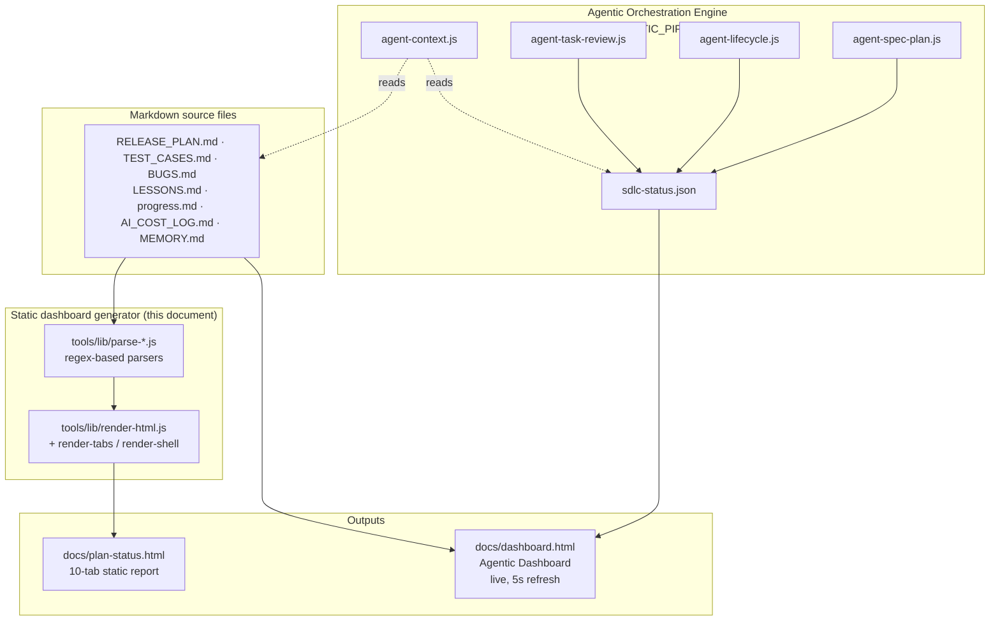

# PlanVisualizer — Technical Architecture

**Version:** 1.6
**Last Updated:** 2026-05-18

> **Scope note:** This document covers the **static dashboard generator** — parsers, renderers, and `plan-status.html` output. The **agentic orchestration engine** (EPIC-0028) — `agent-spec-plan.js`, `agent-lifecycle.js`, `agent-context.js`, `agent-task-review.js`, and the live Agentic Dashboard — has its own dedicated reference at [`docs/architecture/AGENTIC_PIPELINE.md`](./AGENTIC_PIPELINE.md), with mermaid diagrams for the spec/plan phase, per-task lifecycle, review gates, BLOCKED routing, and `sdlc-status.json` schema.

---

## 1. Overview

PlanVisualizer is a Node.js CLI tool with no production runtime dependencies. It reads markdown files, parses them with regex-based parsers, and renders a self-contained HTML dashboard. The output is a single `.html` file deployable anywhere.

Since v2.4.0 it also includes an **agentic orchestration engine** that drives specialist sub-agents through spec → plan → dispatch → per-task review gates with live state on the Agentic Dashboard. See `AGENTIC_PIPELINE.md` for that layer.

### Top-level system diagram



The rest of this document covers the **Generator** + **Outputs** boxes. The Engine box has its own document.

---

## 2. Technology Stack

| Layer          | Technology     | Version | Justification                                             |
| -------------- | -------------- | ------- | --------------------------------------------------------- |
| Runtime        | Node.js        | 18+     | LTS, available everywhere; `fs` and `path` are sufficient |
| Test framework | Jest           | 30.x    | Industry standard; supports coverage reporting            |
| Linter         | ESLint         | 9.x     | Flat config; `eslint:recommended` + security rules        |
| CSS            | Tailwind CSS   | CDN     | Zero build step; utility-first for rapid UI               |
| Charts         | Chart.js       | 4.x CDN | Zero build step; covers all required chart types          |
| Fonts          | Google Fonts   | CDN     | Inter + JetBrains Mono                                    |
| CI             | GitHub Actions | —       | Native to repo; free for public repos                     |
| Hosting        | GitHub Pages   | —       | Zero-config static hosting                                |

---

## 3. Module Structure

```
tools/
  generate-plan.js        CLI entry point; orchestrates all parsers and the renderer
  capture-cost.js         Claude Code stop hook; appends session cost row to AI_COST_LOG.md
  lib/
    parse-release-plan.js  Extracts EPIC/US/TASK artefacts from fenced code blocks
    parse-test-cases.js    Extracts TC artefacts from markdown
    parse-bugs.js          Extracts BUG artefacts from markdown
    parse-cost-log.js      Parses pipe-delimited table rows; aggregates by branch
    parse-coverage.js      Normalises Jest coverage-summary.json into a flat object
    parse-lessons.js       Extracts L-XXXX lesson entries from LESSONS.md
    parse-progress.js      Extracts recent session summaries from progress.md; captures sessionNum
    compute-costs.js       Calculates projected costs; attributes AI costs to stories
    detect-at-risk.js      Flags stories matching at-risk signals (excludes Done stories)
    render-html.js         Assembles complete HTML from a data object

tests/
  unit/                   One test file per lib module (10 suites, 153+ tests)
  fixtures/               Deterministic markdown/JSON samples shared across suites

scripts/
  install.sh              Idempotent bash installer for target projects

plan_visualizer.md        Distributed format reference — exact parser-level format specs for all
                          source files (RELEASE_PLAN.md, TEST_CASES.md, BUGS.md, AI_COST_LOG.md,
                          progress.md). Copied to target projects by install.sh. Referenced from
                          AGENTS.md so AI agents read it at session startup.

.github/
  workflows/
    ci.yml                Lint + test + audit (all branches + PRs)
    codeql.yml            CodeQL analysis (PRs + main + weekly schedule)
    plan-visualizer.yml   Run tests, generate plan-status.html, and deploy to GitHub Pages
  dependabot.yml          Weekly npm and Actions updates
```

---

## 4. Data Flow

```
                 ┌─────────────────────────────────────┐
                 │         generate-plan.js              │
                 │                                       │
  Markdown ──────►  parseReleasePlan()  → epics[]        │
  files          │  parseTestCases()   → testCases[]     │
                 │  parseBugs()        → bugs[]           │──► data{} ──► renderHtml()
                 │  parseCostLog()     → costRows[]       │
  JSON   ────────►  parseCoverage()    → coverage{}      │         │
                 │  parseLessons()     → lessons[]        │         ▼
                 │  parseRecentActivity() → activity[]   │   plan-status.html
                 │                       (+ sessionNum)  │   plan-status.json
                 │  computeProjectedCost()               │
                 │  attributeAICosts() → costs{}         │
                 │  detectAtRisk()     → atRisk{}        │
                 └─────────────────────────────────────┘
```

---

## 5. Parser Design Pattern

All parsers follow a consistent contract:

```js
/**
 * @param {string} markdown  — raw file content (empty string if file missing)
 * @returns {Array}          — typed array of parsed objects (never throws)
 */
function parseXxx(markdown) { ... }
```

**Key design decisions:**

- **Regex, not a markdown parser.** No dependencies. Parsers target the specific format defined in `plan_visualizer.md` (the canonical format reference distributed to target projects).
- **Never throw.** Missing fields default to empty string or zero. The renderer handles absent data gracefully.
- **Fenced code block extraction** (`parse-release-plan.js` only). Epic/story/task definitions must live inside triple-backtick fences to support narrative commentary outside the parseable content.
- **Sliding window slicing** (`parse-bugs.js`, `parse-test-cases.js`). Each artefact block is extracted by finding the next artefact's start index and slicing the markdown between them.

---

## 6. Renderer Architecture

`renderHtml(data)` in `render-html.js` orchestrates 12 sub-renderers, each returning an HTML string:

| Function                      | Output                                                                                                          |
| ----------------------------- | --------------------------------------------------------------------------------------------------------------- |
| `renderTopBar(data)`          | Project name, progress bar, 6 stat tiles                                                                        |
| `renderFilterBar(data)`       | Per-tab contextual filter groups (fgrp-story / fgrp-bug); hidden when no filters apply                          |
| `renderTabs()`                | 7 tab buttons (Hierarchy, Kanban, Traceability, Charts, Costs, Bugs, Lessons)                                   |
| `renderHierarchyTab(data)`    | Collapsible epic → story → AC tree (column view) + story card grid (card view); toggle persists to localStorage |
| `renderKanbanTab(data)`       | 5-column kanban board; each column scrolls independently so headers never leave view                            |
| `renderTraceabilityTab(data)` | Story × TC matrix                                                                                               |
| `renderChartsTab(data)`       | 6 Chart.js canvases at uniform 300 px height (`maintainAspectRatio:false`) + inline `<script>`                  |
| `renderCostsTab(data)`        | Per-story cost table with totals + Bug Fix Costs sub-table with totals row                                      |
| `renderBugsTab(data)`         | Bug register table; rows carry `data-status` and `class="bug-row"` for filtering                                |
| `renderLessonsTab(data)`      | Lessons column/card view with Bug Ref cross-links; toggle persists to localStorage                              |
| `renderRecentActivity(data)`  | Floating activity panel; shows "Session N · YYYY-MM-DD" per entry                                               |
| `renderScripts(data)`         | Tab switching (`showTab` → `updateFilterBar`), filter logic (`applyFilters`), view toggles                      |

**Inline JavaScript** handles all interactivity. No frameworks. Tab switching, filter application, and chart initialisation are implemented as plain functions serialised into the HTML output.

**CSS theme tokens:** All colours are defined as CSS custom properties (`--clr-*`) in `:root` (light) and `html.dark` (dark) blocks. No hardcoded hex literals appear in CSS property rules outside these declarations.

**Chart initialisation** is lazy: charts are only initialised when the Charts tab is first activated (`initCharts()` is nulled after first call to prevent re-render).

---

## 7. Configuration System

`loadConfig()` in `generate-plan.js` merges user config over DEFAULTS using spread:

```js
const config = {
  project: { ...DEFAULTS.project, ...raw.project },
  docs: { ...DEFAULTS.docs, ...raw.docs },
  // ...
};
```

The `plan-visualizer.config.json` is gitignored by default so target projects keep their own local config. `plan-visualizer.config.example.json` is committed as a template.

---

## 8. Cost Attribution System

**Capture** (`capture-cost.js`):

1. Claude Code invokes the stop hook, passing session data as JSON via stdin.
2. The hook reads `cost_usd`, `usage.input_tokens`, `usage.output_tokens`, `usage.cache_read_input_tokens`, and `session_id` from stdin.
3. The current git branch is resolved via `git rev-parse --abbrev-ref HEAD`.
4. A pipe-delimited row is appended to `AI_COST_LOG.md` using `fs.openSync` with the `'a'` flag (append-safe; never overwrites).

**Attribution** (`compute-costs.js`):

1. `parseCostLog()` parses all rows from the log.
2. `aggregateCostByBranch()` sums tokens and cost per branch name.
3. `attributeAICosts()` matches `story.branch` to the aggregated branch map — returning `{ costUsd, inputTokens, outputTokens, sessions }` per story, and `_totals` across all branches.
4. `attributeBugCosts()` matches `bug.fixBranch` to the same branch map — returning `{ costUsd, inputTokens, outputTokens }` per bug; stored as `costs._bugs` in `generate-plan.js`. The `_totals` row already includes bug fix branch costs since it sums all branches.

---

## 9. At-Risk Detection

`detectAtRisk(stories, testCases, bugs)` evaluates four signals per story:

| Signal            | Condition                                                                                     | Meaning                              |
| ----------------- | --------------------------------------------------------------------------------------------- | ------------------------------------ |
| `missingTCs`      | Story has ≥1 AC but zero linked TCs                                                           | Story lacks test coverage            |
| `noBranch`        | `status === 'In Progress'` AND `branch === ''`                                                | Active story has no git branch       |
| `failedTCNoBug`   | A linked TC has `status === 'Fail'` AND `defect === 'None'`                                   | Known failure not tracked as a bug   |
| `openCriticalBug` | A linked bug has `severity === 'Critical' \| 'High'` AND `status === 'Open' \| 'In Progress'` | Unresolved defect blocking the story |

A story is `isAtRisk` if **any signal is true AND the story status is not `Done`**. Done stories are always `isAtRisk: false` regardless of missing TCs or other signals. The ⚠ badge and tooltip are rendered in the Hierarchy tab.

---

## 10. CI/CD Architecture

### ci.yml (all branches + PRs)

Three parallel jobs, all required:

- **lint** — ESLint with `eslint:recommended` + security rules on `tools/**/*.js`
- **test** — Jest with `--coverage`, 80% threshold enforced via `jest.config.js`
- **audit** — `npm audit --audit-level=moderate`

### codeql.yml (PRs + main + weekly)

- GitHub CodeQL JavaScript analysis with `security-extended` query pack
- Results uploaded to GitHub Security tab as SARIF
- Runs on a Monday schedule to avoid burning minutes on every feature branch

### plan-visualizer.yml (docs file changes on main/develop)

- Triggers when `RELEASE_PLAN.md`, `TEST_CASES.md`, `BUGS.md`, `AI_COST_LOG.md`, or `progress.md` change
- Runs `node tools/generate-plan.js`, commits the output, and deploys to GitHub Pages

### dependabot.yml

- Weekly npm updates (Monday 09:00 UTC)
- Weekly GitHub Actions updates (Monday 09:00 UTC)
- Max 5 open PRs per ecosystem

---

## 11. GitHub Pages Deployment

The `plan-visualizer.yml` workflow uses the official `actions/upload-pages-artifact` and `actions/deploy-pages` actions to deploy `docs/` to GitHub Pages. The workflow runs on pushes to `main` or `develop`.

`docs/index.html` contains a `<meta http-equiv="refresh">` redirect to `plan-status.html`, ensuring GitHub Pages serves the dashboard instead of README.md.

> **Requirement:** The `github-pages` environment must list both `main` and `develop` as allowed deployment branches (Settings → Environments → github-pages → Deployment branches).

**Access:** `https://ksyed0.github.io/PlanVisualizer/plan-status.html`

---

## 12. Performance Characteristics

| Operation                    | Typical time | Notes                                |
| ---------------------------- | ------------ | ------------------------------------ |
| `generate-plan.js` full run  | < 200ms      | Pure Node.js I/O + regex             |
| Jest test suite (153+ tests) | < 1s         | No I/O mocking needed                |
| ESLint on `tools/**/*.js`    | < 2s         | ~11 source files                     |
| `npm audit`                  | < 10s        | Network call to npm registry         |
| CodeQL analysis              | 3–5 min      | Depends on codebase size             |
| GitHub Pages deploy          | 1–2 min      | upload-pages-artifact + deploy-pages |
